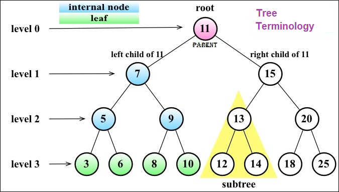

## Trees

✅A non-sequential data structure. A tree is an abstract model of a hierarchical structure. The most common example of a tree in real life would be a family tree or a company organization chart.

☑️Terminology:

A tree consists of __nodes__ with a __parent-child__ relationship. Each node has a parent(except for the first node at the top) and zero or more children.




✔ Binary Tree:

A node in a __binary tree__ has two children at most: one left child and one right child. This definition allows us to write more efficient algorithms to insert, search, and delete nodes to/from a tree.

✔ Binary Search Tree:

A __binary search tree(BST)__ is a binary tree, but it only allows you to store nodes with lesser values on the left-hand side and nodes with greater values on the right-hand side.

✔✔ __Methods__:

```
insert(key):
This method inserts a new key in the tree
```
```
search(key):
This method searches for the key in the tree and returns true if it exists
and false if the node does not exist
```
```
inOrderTraverse():
This method visits all nodes of the tree using in-order traverse
```
```
preOrderTraverse():
This method visits all the nodes of the tree using pre-order traverse
```
```
postOrderTraverse():
This method visits all the nodes of the tree using post-order traverse
```
```
min():
This method returns the minimum value/key in the tree
```
```
max():
This method returns the maximum value/key in the tree
```
```
remove(key):
This method removes the key from the tree
```
##  Tree Traversal

Traversing a tree is the process of visiting all the nodes of a tree and performing an operation at each node.

There are 3 types of tree traversal:
<ol>
  <li><strong>in-order</strong>
  <li><strong>pre-order</strong>
  <li><strong>post-order</strong>
</ol>


***In-order traversal:***

An __in-order__ traversal visits all the nodes of a Binary Search Tree in an ascending order, which means it will visit the nodes from the smallest to the largest. An application of in-order traversal would be to sort a tree.

Implementation:
```JavaScript
  inOrderTraverse(callback){
    this.inOrderTraverseNode(this.root, callback);
  }
  ```
  Helper method:
  ```JavaScript
  inOrderTraverseNode(node, callback){
    if(node != null){
      this.inOrderTraverseNode(node.left, callback);
      callback(node.key);
      this.inOrderTraverseNode(node.right, callback);
    }
  }
  ```
  ***Pre-order traversal***

  A __pre-order__ traversal visits the node prior to its descendants. An application of pre-order traversal could be to print a structured document.

  Implementation
  ```JavaScript
  preOrderTraverse(callback){
    this.preOrderTraverseNode(this.root, callback)
  }
  ```
  Helper Method:
  ```JavaScript
  preOrderTraverseNode(node, callback){
    if(node != null){
      callback(node.key);
      this.preOrderTraverseNode(node.left, callback);
      this.preOrderTraverseNode(node.right, callback);
    }
  }
  ```

  ***Post-order traversal***

  A __post-order__ traversal visits the node after it visits its descendants. An application of post-order traversal could be computing the space used by a file in a directory and its subdirectories.

  Implementation
  ```JavaScript
  postOrderTraverse(callback){
    this.postOrderTraverseNode(this.root, callback);
  }
  ```
  Helper Method:
  ```JavaScript
  postOrderTraverseNode(node, callback){
    if(node != null){
      this.postOrderTraverseNode(node.left, callback);
      this.postOrderTraverseNode(node.right, callback);
      callback(node.key);
    }
  }
  ```
